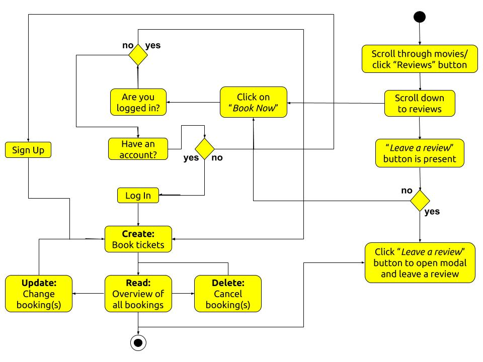

# My Third Project: Cinemagic

This project is based on creating an app/a website that is focussed on showing users different movies made available to watch at Cinemagic cinemas. The goal of this project is to encourage as many users as possible to sign up with Cinemagic to book movie tickets for watching the films advertised and then return to leave their opinions about the films they watched. In addition, this project makes use of the CRUD operations. Users are able to create accounts with Cinemagic, read details about movies and other user’s reviews, update their bookings to make changes to certain features such as the number of tickets they wish to book, the location they want to watch the movie etc and delete their bookings if they change their mind on their movie choice.

# UX

This website/app is for anyone who is interested in watching movies and relies on the personal opinion of others when deciding what movies to watch.
The user will want to achieve the ability to scroll through the movie options and have its details, posters and reviews immediately made available on the same landing page to help them make a decision, quickly on which movies to book tickets for.
Using this project is the best way to achieve this as it has taken precaution to ensure all information about the movies were made available on the homepage and accessible to everyone regardless of whether or not they have set up an account with Cinemagic.

## User Stories

- As a user of Cinemagic, I want to sign up to create an account, so that I can book tickets to watch one of the movies advertised by this company.
- As a user of Cinemagic, I want to create bookings of my movies of choice, so that I can document the: number of tickets, date of showing and location of the cinema I’ve requested.
- As a user of Cinemagic, I want to read the movie details and reviews of the offered movies, so I can make a more informed decision on which movie to select.
- As a user of Cinemagic, I want to read my booking information on my account, so I can be reminded of the: movie name, ticket quantity, showing date and location of the cinema I selected.
- As a user of Cinemagic, I want to be free to update my booking details on my account, so I can make changes to the: movie choice, ticket quantity, showing date and/or location of the cinema I selected if needed.
- As a user of Cinemagic, I want to be free to delete my bookings from my account, so I can declutter my account from unnecessary booking information resulting from having already seen the movie or changing my mind completely and deciding not to watch anymore.

## Designer Goals

- As the designer of Cinemagic, I want to create a sign up page that the user can be automatically directed to if they are not already logged in when trying to make a booking. I also want to ensure only a few relevant pieces of information are requested from the user when signing up, so the sign up process can be a quick and easy one to endure.
- As the designer of Cinemagic, I want to make the booking process appear on a modal whilst still on the homepage and then automatically direct the user to another page displaying all the information they just booked, so the user will have immediate access to their booking information for their reference.
- As the designer of Cinemagic, I want to organise the homepage to display the movie posters alongside their respective movie details and reviews centre-align with the user’s viewpoint, so obtaining information about the movies being offered will be made easier for them.
- As the designer of Cinemagic, I want to structure the user’s bookings page clearly with all the booked information placed in their correct sections and at the centre of the screen, so the user will easily be able to refer to their booked choices.
- As the designer of Cinemagic, I want to provide a fully functioning **_change_** button tailor made for each different set of bookings, so the user can simply press that button to edit the prefilled form of their current booking if they wish to make changes.
- As the designer of Cinemagic, I want to provide a fully functioning **_delete_** button tailor made for each different set of bookings, so the user can simply press that button to delete the respective movie booking they desire.

## Activity Diagram

This is an activity diagram showing how the Cinemagic app/website is intended to be used by the user.

## Wireframes

## Wireframe and Final Project Differences

### Home Page

- The **_Reviews_** button on the carousel was omitted. Instead each movie poster was made clickable where once clicked, the user would be taken to the corresponding movie review section underneath. As a result, the movie posters were fully visible to the users; not blocked in part by any buttons.
- The **_BOOK NOW_** button to be placed underneath the carousel was omitted. The button was left to only exist at the end of each review section making it faster and more convenient for the user to book a specific movie.
- To create a more consistent layout, all the movie’s images were placed on the left-hand side with their details on the right and their reviews at the bottom. Their positions were no longer to be alternated. This was to help user’s learn how to navigate through the website quickly, avoiding frustration.
- The stars for the star rating system were omitted from being used for the final version of the project. The decision was made to focus on the ability of the user to add descriptive comments about the different movies. It was seen as a more informative method for the user to gain a better understanding on how they might perceive the movie if they were to watch it, by scanning through the opinions left by other users.
- For the first selection box of the booking pop-up modal, the name of the respective movie was made the default choice. The **_Ticket Quantity_** selection box was changed into an input box so any number chosen by the user could be inputted (except 0). The title of the last selection box was altered to **_Select Location_**. Also, the **_BOOK NOW_** button was changed to read **_SUBMIT_** to emphasise that this was what will cause the user’s inputted data to be sent to Cinemagic. These changes were made to make it easier for the users to complete the form with ease.
- The **_LEAVE A REVIEW_** button was omitted from the homepage to only be present on the user’s bookings page. This was to make leaving a review simpler for the user as they would be able to reference the correct movie they had watched from the same page they were leaving a comment.

### My Bookings Page

- Regarding the user’s booking page, the images were replaced with their movie details i.e.: number of tickets, location of cinema, date for attendance and the owner of the booking. This aimed to provide a more descriptive account of the bookings when referencing, reading or making changes to them. Using an image was not sufficient. In addition, all the buttons were placed underneath the movie details, for smaller screen sizes, to create a more organised structure on those formats.
- The **_Rate it_** title was replaced with the **_Leave a Review_** title in the leave a review pop-up modal because the stars were omitted; as previously mentioned.
- The delete pop-up modal’s content was changed to include the name of the selected booked movie to be deleted instead of just the **_Are you sure?_** confirmation question. It makes it clearer to the user which movie has been selected for deletion. Also, the **_No_** button was moved to the left-hand side in order to be seen before the **_Yes_** button. This was done to further help avoid the user from deleting a booking by mistake; giving them more time to confirm.

### Administration Page

- An admin page was added. This was to only be accessible to the administration user. The decision was made to add this page to provide an easier way to interact with the MongoDB database when handling data.

### Footer

- The **_BOOK NOW_** button was removed from the user’s bookings page as it could not have the respective movie names as a default selected choice due to there being no other content on the page whenever no bookings were present. This button was to only exist on the homepage as a result.
- In an attempt to add more design to the footer, the social icons were styled in a grid on top of each other instead of just being inline for all screen sizes.

# Features

## Existing Features

### Top Navigation Bar

- The top navigation bar allows users to access different parts of this project’s app/website by clicking on the links provided at the top of larger screen sized devices. It also displays the name/logo of the movie company for the users to read/see and develop name recognition for Cinemagic.

### Side Navigation Bar

- The side navigation bar allows users to access the company’s navigation links at the side of smaller screen sized devices by clicking/tapping them. This makes the navigation links more responsive on smaller screen sizes as the side navigation bar avoids using a lot of space at the top and is hidden at the side to make room for more of the app/website content to be seen by the user.

### Home Page

- The home page allows users to view available movies to be booked, from the carousel and from scrolling down the rest of the page. It also allows users to click/tap on the carousel movie images to be automatically jumped down to the corresponding section of the page for more details about the movie.
- The homepage allows users to view reviews about the movies on offer, created by other users of the website, by scrolling down the page to the corresponding movie sections so the user can be assisted in making a decision on which movies to book.
- The home page allows users to book tickets, a location and a date to watch their selected movie by having them fill out a form that appears in the style of a pop-up modal, before being redirected to their bookings account page.
- The homepage allows users to scroll down to the bottom of the page to find information about the company telling the users who Cinemagic are by reading their about us section.

### Sign Up Page

- The sign up page allows users to create an account with Cinemagic in order to make bookings of the movies they wish to watch, by having them fill out a form requesting a few of their personal details.

### Login Page

- The login page allows users to log into the app/website to access their bookings page, by filling out the login form with the personal details they used to create an account and having those verified and authenticated to ensure they are correct.

### My Bookings Page

- The my bookings page allows users to read, update and delete their created bookings they made from the homepage by reading through the page and clicking/tapping on the respective buttons to open up the corresponding modals.
- The my bookings page allows users to leave a review on the movies they booked/watched, to be sent to the respective review sections in the home page for other users of the app/website to view and read, by filling out the form that appears as a pop-up modal once the leave a review button is clicked/tapped.

### Administration Page

- The administration page allows the administrator of the app/website to read, update and delete the current movies and locations offered by Cinemagic by having them read the page’s contents, edit the forms on a pop-up modal and confirm the option of deleting them if chosen to do so.
- The administration page allows the administrator of the app/website to create and upload new movies and locations for the company by having them fill out forms in the pop-up modals.
- The administration page allows the administrator of the app/website to read the user’s: sign up details, bookings and movie reviews by scrolling down the rest of the page.
- The administration page allows the administrator of the app/website to change and/or delete the user’s sign up/login details.
- The administration page allows the administrator of the app/website to delete the user’s reviews.

### Footer

- The footer allows the users to view links to Cinemagic’s social media outlets and contact details by scrolling to the bottom of the page to read its contents and click/tap on the social links if interested in following their social media handles.

# Technologies Used

## [Python](https://www.python.org/) and [Flask](https://flask.palletsprojects.com/en/1.1.x/quickstart/)

- This project used Python with Flask to produce the backend code that runs on the server, to create the Cinemagic app/website.

## OS

- This project used OS to provide functions for interacting with the operating system for the Cinemagic app/website.

## Bson.objectid

- This project used bson.objectid to enable the use of ObjectID when referring to the **_\_id_** data names within the MongoDB database, to produce the data on to the Cinemagic app/website.

## [Werkzeug](https://werkzeug.palletsprojects.com/en/1.0.x/)

- This project used werkzeug.security to provide password authentication when checking for a matched password entered by the user on the Cinemagic app/website.

## [MongoDB](https://www.mongodb.com/)

- This project used MongoDB to create, store, read, update and delete data regarding the movie details, locations, user details, user reviews and user bookings of the Cinemagic app/website.

## [Heroku](https://www.heroku.com/)

- This project used Heroku to deploy and display the final finished version of the Cinemagic app/website.

## [PyMongo](https://pypi.org/project/pymongo/)

- This project used flask_pymongo to utilise the PyMongo library in order to allow for interactions with the MongoDB database through Python, for the Cinemagic app/website.

## Requirements.txt

- This project used a requirements.txt file to allow Heroku to detect the Cinemagic app/website as a Python app.

## Procfile

- This project used a Procfile to inform Heroku on how to run this project’s Cinemagic app/website.

## HTML

- This project used HTML to create the basic structure and layout of the Cinemagic app/website.

## CSS

- This project used CSS to add design to the basic structure and layout of the Cinemagic app/website.

## JavaScript

- This project used JavaScript to add functionality to the features of the Cinemagic app/website.

## [jQuery](https://jquery.com/)

- This project used jQuery to speed up the process of adding the JavaScript functionality to the Cinemagic app/website.

## [Materialize](https://materializecss.com/)

- This project used Materialize to provide the code of the movie carousel, modals, forms, buttons, tables and navigation bars present in the Cinemagic app/website.

## [Font Awesome](https://fontawesome.com/)

- This project used Font Awesome to provide the icons used in the Cinemagic app/website.

## [Google Fonts](https://fonts.google.com/)

- This project used Google Fonts to provide the font style of the movie posters and the overall appearance of the Cinemagic app/website.

## [Chrome Development Tools](https://developers.google.com/web/tools/chrome-devtools)

- This project used Chrome Development Tools to see how responsive the Cinemagic app/website looked on different screen sizes and was also used to debug issues regarding editing code taken from external frameworks and libraries.

## [W3C Markup Validation Service](https://validator.w3.org/)

- This project used W3C Markup Validation Service to check for errors, requiring correction, present in the HTML code of the Cinemagic app/website.

## [CSS Validation Service](https://jigsaw.w3.org/css-validator/)

- This project used CSS Validation Service to check for errors, requiring correction, present in the CSS code of the Cinemagic app/website.

## [Gitpod](https://www.gitpod.io/)

- This project used Gitpod as the editor for coding out the README file, HTML, CSS, JavaScript, jQuery and Python portions of the Cinemagic app/website. External libraries and frameworks and images and wireframes were also stored here. In addition, its terminal was used to conduct commands such as: **_git status_**, **_git add ._**, **_git commit -m “...”_**, **_git push -u heroku master_** etc. to complete this project.

## [GitHub](https://github.com/)

- This project used GitHub to store the Cinemagic app/website saved code via the **_git push_** command, as repositories.

## [Balsamiq Wireframes](https://balsamiq.com/)

- This project used Balsamiq Wireframes to create mockups of what the Cinemagic app/website aimed to look like to the user, on completion.

## Snipping Tool

- This project used the Snipping Tool to edit the movie posters and wireframes for the Cinemagic app/website, as images to be stored on Gitpod.

## [Jasmine Testing](https://jasmine.github.io/index.html)

- The project used Jasmine Testing to test the functionality of the JavaScript/jQuery used in the Cinemagic app/website.

# Testing

## Base.html

### Links

1. Check to see if the Google Font link is working across this project by going through each page on this app/website and ensuring the predominate font used for the text is **_Scada_** or its backup which is **_sans-serif_**.
2. Check to see if the Font Awesome link is working across this project by going through each page on this app/website and ensuring all the icons used from Font Awesome, appears accordingly.
3. Check to see if the Materialize CSS and JS links are working across this project by going through each page on this app/website and ensuring the features taken from Materialize i.e: carousel, forms, modals, cards, navigation bars, tables and buttons are displayed on the pages and can be interacted with by the user.
4. Check to see if the custom CSS link is working across this project by setting the whole page’s background to a very noticeable colour in the **_style.css_** file, ensuring that the same background colour is displayed on the pages of the app/website.
5. Check to see if the jQuery CDN link is working across this project by using **_console.log(“Hello World!”)_** in a jQuery function, present in the **_scripts.js_** file and then accessing the console in the chrome development tools to see if the message can be seen from there.
6. Check to see if the custom JS link is working across this project by using **_console.log(“Hello World!”)_** in a custom JavaScript function, present in the **_scripts.js_** file and then accessing the console in the chrome development tools to see if the message can be seen from there.

### Page Title

1. Go to the home page.
2. Check the page title in the tab of the opened up brower and ensure its name is the same to the assigned name in the **_base.html_** file.

### Inherited Templates

1. Write the test message: **_Hello World!_** in the **_index.html_** file, set to inherit the code from the **_base.html_** file.
2. Go to the home page.
3. Check to see if the same **_Hello World!_** is present on this page, as if it is then the template has successfully inherited the code.

### Top Navigation Bar

1. Go to the home page.
2. Using the chrome development tools’ toggle device toolbar to ensure: the navigation bar, its title, bars icon and/or links are all clearly visible and legible on different screen sizes ranging from 320px to 1200px.
3. Drag the chrome development tools’ toggle device toolbar, to ensure the bars icon is displayed from screen sizes 320px to 992px and then removed for screen sizes at 993px or higher.
4. Whilst continuing to drag the chrome development tools’ toggle device toolbar, ensure the navigation links for the other pages of this app/website appear on the right-hand side of the navigation bar for screen sizes greater than 993px.
5. Hover the cursor over the newly appeared links on the navigation bar to ensure a different background colour is shown for the respective link hovered over.
6. Click on each link present in the navigation bar to ensure they take the user to the correct page based on what the link is called. E.g. click on the **_Sign Up_** page to ensure the user is redirected to the page where the user can sign up to create an account. For another example, click on the **_My Bookings Page_** to ensure the user is redirected to the page that will showcase where their booked movies are stored.
7. Ensure the correct link options are shown in the navigation bar, based on the type of user that is interacting with the website.
   1. If the user is logged in as administration, ensure the links shown are: **_Home_**, **_Admin_** and **_Logout_**.
   2. If the user is logged in but not as administration, ensure the links shown are: **_Home_**, **_My Bookings_** and **_Logout_**.
   3. If the user is not logged in, ensure the links shown are: **_Home_**, **_Sign Up_** and **_Log In_**.
8. Run its code on both the W3C Markup Validation Service and CSS Validation Service to ensure no errors are found with its HTML and CSS.

### Side Navigation Bar

1. Go to the home page.
2. Using the chrome development tools, drag the toggle device toolbar to check that the bars icon, for this navigation bar, is clearly visible on different screen sizes ranging from 320px to 992px and then is removed for screen sizes at 993px or higher.
3. Upon clicking the bars icon, ensure the current page of the app/website is covered with a dark, transparent overlay and the side navigation bar appears on the left-hand side of the screen, on top of the overlay.
4. Check the navigation bar to ensure the links and their icons are easy to see and read then hover the cursor over them to ensure a different background colour is shown for the respective link hovered over.
5. Click on each link present in the navigation bar to ensure they take the user to the correct page based on what the link is called. E.g. click on the **_Sign Up_** page to ensure the user is redirected to the page where the user can sign up to create an account. For another example, click on the **_My Bookings Page_** to ensure the user is redirected to the page that will showcase where their booked movies are stored.
6. Ensure the correct link options are shown in the navigation bar, based on the type of user that is interacting with the website.
   1. If the user is logged in as administration, ensure the links shown are: **_Home_**, **_Admin_** and **_Logout_**.
   2. If the user is logged in but not as administration, ensure the links shown are: **_Home_**, **_My Bookings_** and **_Logout_**.
   3. If the user is not logged in, ensure the links shown are: **_Home_**, **_Sign Up_** and **_Log In_**.
7. Run its code on both the W3C Markup Validation Service and CSS Validation Service to ensure no errors are found with its HTML and CSS.

### Footer

1. Go to the home page.
2. Using the chrome development tools, drag the toggle device toolbar to check both the social media icons and the contact details stay within the footer area without going over it and are legible on all different screen sizes, from 320px to 1200px, to ensure their responsiveness.
3. Whilst dragging the toggle device toolbar, also check that the footer remains at the bottom of the screen for every screen size and covers the full width of the screen without going over.
4. Click on each social media icon and check that a separate tab opens, away from the project, to the homepage of the respective social media website.
5. Run its code on both the W3C Markup Validation Service and CSS Validation Service to ensure no errors are found with its HTML and CSS.

## Signup.html

### Overall Sign Up Page

1. Go to the sign up form page.
2. Using the chrome development tools, drag the toggle device toolbar to check that the sign up page’s title, form and link are all responsive for screen sizes ranging from 320px to 1200px by being clearly visible and fitting the screen well on every screen size.
3. Run its code on both the W3C Markup Validation Service and CSS Validation Service to ensure no errors are found with its HTML and CSS.

### Form

1. Attempt to send the form, by clicking on the **_SIGN UP_** button, after completing the form partially or without filling in the details of the form all together, to ensure the **_required_** attributes placed in the code prevents the form from submitting. A prompt to complete the missing part(s) of the form should appear.
2. Attempt to submit the form with an email address with an invalid structure i.e: without **_@/.com_** etc., to get an error prompt informing the user that the email they have inputted is not a valid one.
3. Attempt to submit the form with an input in both the username and password fields that is less than 4 characters in length and then again but with an input that is greater than 14 characters in length. On both occasions, this test should fail to ensure that the **_minlength="4"_** and **_maxlength="14"_** attributes are working properly.
4. Conduct unit testing for the signup form, as seen in the [**_tests.py_**](unit-testing/tests.py) and [**_validator.py_**](unit-testing/validator.py) files, to ensure usernames entered in the form meet the requirements of the **_minlength="4"_** and **_maxlength="14"_** attributes.
5. Check the password field of the form hides its inputted content from the user with small, black, circle, dots. This ensures the **_type="password"_** is working as it should.
6. Create an account following the instructions of the form using the: username of **_test01_**, email of **_test01@testing.com_** and password of **_test1_**, ensuring it is possible to successfully create an account.
7. On completion, check that the user has been redirected to the homepage automatically, with the flash message of: **_Sign Up Successful! Welcome Test01!_**, displaying on the top of the screen and underneath the top navigation bar. Also ensure the username in the flash message starts with a capital letter to verify that the **_.capitalize()_** method is working.
8. Return to the sign up page and attempt to sign up again with the same username and/or email address as mentioned before. Verify that the user is not redirected to the homepage as before and the correct flash error message of: **_Username And/Or Email Already Registered!_**, appears above the form. This will prove that the **_if request.method == "POST":_** if condition in the **_signup()_** function of the **_app.py_** file is working and checking the correct collection in the MongoDB database to find that someone is already registered with the same details and therefore the user would have to choose another username and/or email address.

### Log In Link

1. Click on the **_Log In_** link underneath the form to check if it redirects the user to the login page to ensure the **_{{ url_for('login') }}_** for the link works.

## Login.html

### Overall Login Page

1. Go to the login form page.
2. Using the chrome development tools, drag the toggle device toolbar to check that the login page’s title, form and link are all responsive for screen sizes ranging from 320px to 1200px by being clearly visible and fitting the screen well on every screen size.
3. Run its code on both the W3C Markup Validation Service and CSS Validation Service to ensure no errors are found with its HTML and CSS.

### Form

1. Attempt to send the form, by clicking on the **_LOG IN_** button, after completing the form partially or without filling in the details of the form all together, to ensure the **_required_** attributes placed in the code prevents the form from submitting. A prompt to complete the missing part(s) of the form should appear.
2. Attempt to login with a username and/or password that has not been registered and therefore not stored in the MongoDB database. For example, enter **_test02_** as the username and **_test2_** as the password. Ensure the flash error message of: **_Incorrect Username And/Or Password_**, appears above the form once the **_LOG IN_** button is clicked. At this point, also make sure that the user is not redirected to the homepage. This ensures that the **_if request.method == "POST":_** if condition in the **_login()_** function of the **_app.py_** file is working by seeing if the username entered exists in the MongoDB database. It also ensures that the hashed password stored in the database matches the hashed password created by the just logged in password.
3. Login in with the same details used to test the sign up form. Check that the user is automatically sent to the homepage with the correct flash message stating: **_Welcome Back Test01!_** at the top, ensuring the username in the flash message starts with a capital letter to verify that the **_.capitalize()_** method is working.

### Sign Up Link

1. Click on the **_Sign Up_** link underneath the form to check if it redirects the user to the sign up page to ensure the **_{{ url_for(signup) }}_** for the link works.

## Index.html

### Overall Home Page

1. Go to the home page.
2. Using the chrome development tools, drag the toggle device toolbar to check that the home page’s title, carousel and movie detail areas are all responsive for screen sizes ranging from 320px to 1200px by being clearly visible and fitting the screen well on every screen size.
3. Run its code on both the W3C Markup Validation Service and CSS Validation Service to ensure no errors are found with its HTML and CSS.

### Carousel

1. Write test code using **_Jinja_** dot notation in the HTML file in an attempt to get the images stored in the MongoDB **_movies_** collection, with the use of **_movie.movie_poster_**. Place **_movie.movie_poster_** inside its for loop to see if the **_movie_** successfully iterates through the **_movies_** MongoDB collection. This will also test if the **_.find()_** method for retrieving data from MongoDB is functioning correctly.
2. Using the Jasmine testing framework, test the **_true_** and **_false_** values in the jQuery code of the carousel taken from Materialize, to check they are found to be the correct booleans.
   1. Using **_red green refactoring_**, use Jasmine to write tests that will fail then slightly alter the code on a minimum level to get the test to pass, as seen in the [**_movieSpec.js_**](jasmine-testing/spec/movieSpec.js) file and the [**_movie.js_**](jasmine-testing/scripts/movie.js) file. For instance, when checking to see if the **_fullWidth_** variable is the **_true_** boolean, write inside the **_toBe()_** method the **_false_** boolean to make the test fail. Then make the test pass by writing in the **_true_** boolean instead.
3. Using the Jasmine testing framework, test the number values in the jQuery code of the carousel taken from Materialize, to ensure they are numbers.
   1. Using **_red green refactoring_**, use Jasmine to write tests that will fail then slightly alter the code on a minimum level to get the test to pass, as seen in the [**_movieSpec.js_**](jasmine-testing/spec/movieSpec.js) file and the [**_movie.js_**](jasmine-testing/scripts/movie.js) file. For instance, when checking to see if the **_dist_** variable is a number, i.e. **_0_** , write inside the **_toBe()_** method the string **_zero_** to make the test fail. Then make the test pass by writing in the number **_0_** instead.
4. With the cursor, vertically slide the carousel to ensure that the image moves swiftly across the screen.
5. Hover over the carousel indicators to make sure they increase in size when the cursor is hovered over them.
6. Click on a carousel indicator to make sure the indicator changes colour and moves the carousel to the next respective movie in the row; partnered with the selected indicator.
7. Click on the movie images in the carousel and check that the page jumps down to the respective section that displays the movie details, reviews and **_BOOK NOW_** button for the same movie that was clicked on.

### Movie Details

1. Add a test image to the MongoDB collection called **_movies_**. Use the **_.find()_** method in the**_app.py_** file to access this image in the collection and then produce it onto the HTML file. Ensure the image can be seen when the collection is being called out within its for loop.
2. Type **_test01_** as the key pair value of **_Rated_** in the MongoDB **_movies_** collection. Then use the **_.find()_** method in the **_app.py_** file, to bring out the **_Rated_** value to the movie details section. Check to see that **_Rated: test01_** is produced to ensure the data from MongoDB is being retrieved successfully.

### Reviews Display

1. Test the **_.find()_** method in the **_home()_** function by completing the **_Leave a Review_** modal on the **_My Bookings_** page, for the **_Roldo_** movie. Hit the **_SUBMIT_** button to send the review. Once sent, view the review section of the **_Roldo_** movie to make sure the review can be seen.

### **_BOOK NOW_** Buttons

1. When not logged in, click the **_BOOK NOW_** buttons to check that each of them redirects the user to the **_Log In_** page, so the user can log in.
2. When logged in and the session user is not administration, click the **_BOOK NOW_** buttons to check that each of them open up a modal with the form needed to be completed in order to book the movies.
3. When logged in and the session user is administration, ensure the **_BOOK NOW_** buttons are omitted from the home page so no bookings can be made.

### Booking Modal

1. Click on each **_SUBMIT_** button in every modal without completing the form to ensure it doesn’t submit. Check that an alert message to complete the forms input appears, to show the **_required_** attribute is functioning.
2. Click on the first input, in each modal, to check the default option is labelled correctly, in correspondence to the movie being booked. Ensure there are no other dropdown options for this input.
3. Attempt to type in **_test_** into the **_Ticket Quantity_** input to make sure it doesn’t show as only numbers have been permitted for this input with the use of the **_type="number"_** attribute.
4. Attempt to type in 0 into the **_Ticket Quantity_** input in order to elicit an error message to appear stating that the number must be at least 1. This will confirm if the **_min="1"_** attribute is working.
5. Click on the **_Date_** input to ensure the datepicker appears.
6. Click on a date on the calendar to make sure a day can be selected and that its background and font colour change.
7. Try each of the buttons present on the datepicker to ensure they work correctly.
   1. Click on the **_CLEAR_** button and see if the datepicker automatically closes.
   2. Click on the **_CANCEL_** button and see if the datepicker automatically closes.
   3. Click on the **_SELECT_** button, after selecting a date, and see if the datepicker automatically closes and displays the selected date in the input.
8. Click on the last input labelled **_Select Location_** to see if the dropdown feature works.
   1. Check that the **_.find()_** method in the **_app.py_** file of the **_home()_** function for the **_locations_** collection in the MongoDB database, is bringing out the list of locations for this input.
   2. Read the locations listed in the dropdown input and make sure they are being listed in alphabetical order, to confirm the **_sort("location_name", 1)_** from the **_app.py_** file is working.
9. Using the Jasmine testing framework, test the **_true_** value in the jQuery code of the datepicker taken from Materialize, to ensure the boolean is correct.
   1. Using **_red green refactoring_**, use Jasmine to write tests that will fail then slightly alter the code on a minimum level to get the test to pass, as seen in the [**_movieSpec.js_**](jasmine-testing/spec/movieSpec.js) file and the [**_movie.js_**](jasmine-testing/scripts/movie.js) file. For instance, when checking to see if the **_showClearBtn_** variable is the **_true_** boolean, write inside the **_toBe()_** method the **_false_** boolean to make the test fail. Then make the test pass by writing in the **_true_** boolean instead.
10. Using the Jasmine testing framework, test the number values in the jQuery code of the datepicker taken from Materialize, to ensure they are numbers.
    1. Using **_red green refactoring_**, use Jasmine to write tests that will fail then slightly alter the code on a minimum level to get the test to pass, as seen in the [**_movieSpec.js_**](jasmine-testing/spec/movieSpec.js) file and the [**_movie.js_**](jasmine-testing/scripts/movie.js) file. For instance, when checking to see if the **_yearRange_** variable is a number, i.e. **_3_**, write inside the **_toBe()_** method the string **_three_** to make the test fail. Then make the test pass by writing in the number **_3_** instead.
11. Click on the cross icon at the top right-hand side of the modal to ensure the modal will close when done so. Also click outside of the modal to check that this can also close the modal once opened.
12. Fully and correctly complete the booking modal for one of the movies and submit the form. On submission, ensure the flash message of: **_Booking Successfully Added!_** appears at the top of the screen to check the form is able to be sent once filled in appropriately.

## My_bookings.html

### Overall My Bookings Page

1. Go to my bookings page.
2. Using the chrome development tools, drag the toggle device toolbar to check that the my bookings page’s title, booked details and buttons are all responsive for screen sizes ranging from 320px to 1200px by being clearly visible and fitting the screen well on every screen size.
3. Run its code on both the W3C Markup Validation Service and CSS Validation Service to ensure no errors are found with its HTML and CSS.

### Update Booking

1. Click on the **_CHANGE_** button to make sure the modal for changing the booking opens up.
2. Click the **_CANCEL_** button, cross icon in the top right-hand corner and then later outside the modal, to check that they all can close the modal without any effect to the current booking.
3. View the modal and ensure all the inputs are filled in with default selections that are the details of the current booking. This shows the **_booked_details_** collection, from the MongoDB database has been successfully accessed to bring out the movie details booked from the homepage.
4. View the first input default selected option to make sure it is the same as the booking.
   1. Click on the first input box and make sure all the movie options offered by Cinemagic can be seen once dropped down. This will show that the **_find()_** method in the **_my_bookings()_** function is working. In addition, ensure the list of movies displayed is done so in alphabetical order to demonstrate the **_sort("movie_name", 1)_** method is also working.
   2. Click on a different movie option in the dropdown select box to ensure the current movie can be changed in the input.
5. View the second input default selected option to make sure it is the same as the booking.
   1. Change the current **_Ticket Quantity_** input to a different number to see if it can be changed.
   2. Change the current number to 0 to elicit an error stating that the amount must be at least 1.
   3. Remove the current number and attempt to write the string **_test_** to ensure nothing appears in the input meaning the **_type="number"_** attribute is working, only allowing numbers to be entered.
   4. Delete the content in this input and submit the form to elicit the error stating that the input must be filled in before submission. This will ensure the **_required_** attribute in its code is working.
6. View the third input default selected option to make sure it is the same as the booking.
   1. Select a different date from the datepicker to see if the current date can be changed on the form.
   2. Delete the content in this input and submit the form to elicit the error stating that the input must be filled in before submission. This will ensure the **_required_** attribute in its code is working.
   3. Conduct the same Jasmine testing for this datepicker, as done before with the datepicker on the home page, so the boolean and number values are proven to be booleans and numbers only.
7. View the last input default selected option to make sure it is the same as the booking.
   1. Click on the input to ensure the dropdown options for the other locations are shown. This will show that the **_find()_** method in the **_my_bookings()_** function is working. In addition, ensure the list of movies displayed is done so in alphabetical order to demonstrate the **_sort("location_name", 1)_** method is also working.
   2. Select a different location for the last input on the modal to see if the location can be changed on the form.
8. Click the **_CONFIRM_** button to see if the changes made are saved and updated to the booking.
   1. Ensure clicking this button doesn’t redirect away from the current **_My Bookings_** page.
   2. If the booking updates, then the MongoDB **_update()_** method has been successful in targeting the correct **_\_id_** and **_ObjectId_** to change the booking.
   3. In addition, ensure the flash message saying: **_Booking Successfully Updated!_** is displayed at the top of the screen.

### Review Movie

1. Click on the **_LEAVE A REVIEW_** button to make sure the modal for leaving reviews opens up.
2. Click on the cross icon on the right-hand side and then click outside the modal to ensure both methods can close the modal without anything being written in the review text box.
3. Open back up the modal for leaving a review and view the first input and ensure the default selected movie name is the same as the booked movie selected. Meaning the **_find()_** method, in the **_my_bookings()_** function, for the **movies** collection in the MongoDB database, is working.
   1. Click on the movie name input to make sure no other movie options are present.
4. Click the **_SUBMIT_** button to submit the form without completing the review box to elicit an error stating the form cannot be submitted unless its text box has been filled in. This demonstrates the **_required_** attribute in its code is working.
5. Type in **_test_** in the review box to ensure the text inputted is visible and legible.
6. After entering some text in the review box, click the **_SUBMIT_** button again to see if the form submits successfully.
   1. Ensure the page is redirected back to the home page on submission, showing the **_redirect(url_for("home"))_** is operating accordingly.
   2. Ensure the flash message stating **_Review Successfully Posted!_** appears at the top of the home page.
   3. Scroll down to the respective movie that the review was made about and view the review section to see if the review, along with the name of the user who made the review, are both present. If so, the **_find()_** method has been able to successfully access the **_reviews_** collection in the MongoDB database and bring it out to be seen on the homepage.
   4. Check inside the **_reviews_** collection in the MongoDB database to see if the **_insert_one(reviews)_** method was able to store the **_reviews_** key pair values in there.

### Delete Booking

1. Click on the **_DELETE_** button to make sure the modal for deleting bookings opens up.
2. Ensure the correct name of the movie selected appears in the modal.
3. Test the modal in the following ways to ensure it can be closed:
   1. Click on the cross icon on the right-hand side.
   2. Click anywhere outside the modal.
   3. Click on the **_NO_** button inside the modal.
4. Click on the**_YES_** button inside the modal to delete the selected movie option.
   1. Ensure the modal disappears and the page is not redirected elsewhere and remains on the **_My Bookings_** page to show the **_redirect(url_for("my_bookings"))_** is working.
   2. Ensure the flash message stating **_Booking Successfully Deleted!_** appears at the top of the screen.
   3. Scroll through the **_My Bookings_** page and ensure the deleted booking is no longer present on the page. This shows the **_remove({"\_id": ObjectId(booked_details_id)})_** method has successfully deleted the booking from the database.
   4. View the **_booked_details_** collection in MongoDB to confirm that the booking has been removed and is no longer present in the collection.

### View Session User Bookings

1. Create two new accounts with the user names of: **_newAccount01_** and **_newAccount02_**.
2. Create a new movie booking for both of these accounts and visit the **_My Bookings_** page on separate occasions, after making movie bookings for both accounts.
3. When logged in as the **_newAccount01_** user, ensure the booking details of the **_newAccount02_** user cannot be seen and vice versa. This will show that the **_if session.user|lower == booking.booked_by|lower_** if condition, in the **_my_bookings_** HTML file is operating correctly; allowing the current session user to be able to only view the bookings made by them and not by others.

## Administration.html

### Overall Admin Page

1. Go to the administration page.
2. Using the chrome development tools, drag the toggle device toolbar to check that the administration page’s title, buttons and tables containing the company’s: movie, location, user, user bookings and user review details are all responsive for screen sizes ranging from 320px to 1200px by being clearly visible and fitting the screen well on every screen size.
3. Run its code on both the W3C Markup Validation Service and CSS Validation Service to ensure no errors are found with its HTML and CSS.

### Administration Home Page

1. Scroll through the home page, logged in as administration and check that the **\*_BOOK NOW_** buttons under the review sections have been removed; therefore cannot be seen by this current session user.

### Delete Movies

1. Click on the **_DELETE_** button to make sure the modal for deleting the movie opens up.
2. Ensure the correct name of the movie selected appears in the modal.
3. Test the modal in the following ways to ensure it can be closed:
   1. Click on the cross icon on the right-hand side.
   2. Click anywhere outside the modal.
   3. Click on the **_NO_** button inside the modal.
4. Click on the **_YES_** button inside the modal to delete the selected movie.
   1. Ensure the modal disappears and the page is not redirected elsewhere and remains on the **_Admin_** page to show the **_redirect(url_for("admin"))_** is working.
5. Ensure the flash message stating **_Movie Successfully Deleted!_** appears at the top of the screen.
6. Scroll through the **_Admin_** page and ensure the deleted movie is no longer present on the page. This shows the **_remove({"\_id": ObjectId(movie_id)})_** method has successfully deleted the movie from the database.
7. View the **_movies_** collection in MongoDB to confirm that the movie has been removed and is no longer present in the collection.

### Change Movies

1. Click on the **_CHANGE_** button to make sure the modal for changing the movie opens up.
2. Test the modal in the following ways to ensure it can be closed without affecting the selected movie:
   1. Click on the cross icon on the right-hand side.
   2. Click anywhere outside the modal.
   3. Click on the **_CANCEL_** button inside the modal.
3. View the contents of the modal to ensure all the inputs are already filled in with their default movie details. This shows the **_movies_** collection, from the MongoDB database has been successfully accessed to bring out these movie details.
4. Delete the content from each input field and then click the **_CONFIRM_** button to elicit the error stating that the inputs must be filled in before submission. This will ensure the **_required_** attribute in its code is working.
5. Change the content from each text input field and then click the **_CONFIRM_** button to see if the form submits.
   1. Ensure clicking this button doesn’t redirect away from the current **_Admin_** page.
6. Ensure the flash message saying: **_Movie Successfully Updated!_** is displayed at the top of the screen.
7. Check the movie details section to see if the movie information has been updated. If the movie details changed, then the MongoDB **_update()_** method has been successful in targeting the correct **_\_id_** and **_ObjectId_** to change the movie.

### Add Movies

1. Click on the **_ADD MOVIE_** button to make sure the modal for adding new movies opens up.
2. Test the modal in the following ways to ensure it can be closed:
   1. Click on the cross icon on the right-hand side.
   2. Click anywhere outside the modal.
3. View the inputs in this modal and ensure they are empty when first approached.
4. Attempt to submit this empty form by clicking on the **_SUBMIT_** button to elicit the error stating that all inputs must be filled in before submission. This will ensure the **_required_** attribute in its code is working.
5. Fill in the form with the string **_test_** and click the **_SUBMIT_** button to see if this test movie gets added to the page.
6. Ensure the page is not redirected away from the **_admin_** page; showing the **_redirect(url_for("admin"))_** is working.
7. Ensure the flash message stating **_New Movie Successfully Added!_** is displayed at the top of the screen.
8. Scroll down the movie section and ensure the new test movie, that has been added, can be clearly seen.

### Change Locations

1. Click on the **_CHANGE_** button to make sure the modal for changing the location opens up.
2. Test the modal in the following ways to ensure it can be closed without affecting the selected location:
   1. Click on the cross icon on the right-hand side.
   2. Click anywhere outside the modal.
   3. Click on the **_CANCEL_** button inside the modal.
3. View the content of the modal to ensure the input field is already filled in with its default location. This shows the **_locations_** collection, from the MongoDB database has been successfully accessed to bring out the respective location.
4. Delete the default content from the input field then click the **_CONFIRM_** button to elicit the error stating that the input must be filled in before submission. This verifies that the **_required_** attribute in its code is working.
5. Change the content in the already filled in input field to a different location name and then click the **_CONFIRM_** button to see if the form submits.
   1. Ensure clicking this button doesn’t redirect away from the current **_Admin_** page.
6. Ensure the flash message saying: **_Location Successfully Updated!_** is displayed at the top of the screen.
7. Check the location section to see if the location information has been updated. If the location changed, then the MongoDB **_update()_** method has been successful in targeting the correct **_\_id_** and **_ObjectId_** to change the location.

### Delete Locations

1. Click on the **_DELETE_** button to make sure the modal for deleting the location opens up.
2. Ensure the correct name of the location selected appears in the modal.
3. Test the modal in the following ways to ensure it can be closed:
   1. Click on the cross icon on the right-hand side.
   2. Click anywhere outside the modal.
   3. Click on the **_NO_** button inside the modal.
4. Click on the **_YES_** button inside the modal to delete the selected location.
   1. Ensure the modal disappears and the page is not redirected elsewhere and remains on the **_Admin_** page to show the **_redirect(url_for("admin"))_** is working.
5. Ensure the flash message stating **_Location Successfully Deleted!_** appears at the top of the screen.
6. Scroll through the **_Admin_** page and ensure the deleted location is no longer present on the page. This shows the **_remove({"\_id": ObjectId(location_id)})_** method has successfully deleted the location from the database.
7. View the **_locations_** collection in MongoDB to confirm that the location has been removed and is no longer present in the collection.

### Add Locations

1. Click on the **_ADD LOCATION_** button to make sure the modal for adding new locations opens up.
2. Test the modal in the following ways to ensure it can be closed:
   1. Click on the cross icon on the right-hand side.
   2. Click anywhere outside the modal.
3. View the input in this modal and ensure it is empty when first approached.
4. Attempt to submit this empty form by clicking on the **_SUBMIT_** button to elicit the error stating that the input must be filled in before submission. This will ensure the **_required_** attribute in its code is working.
5. Fill in the form with the string **_test_** and click the **_SUBMIT_** button to see if this test location gets added to the page.
6. Ensure the page is not redirected away from the **_admin_** page; showing the **_redirect(url_for("admin"))_** is working.
7. Ensure the flash message stating **_New Location Successfully Added!_** is displayed at the top of the screen.
8. Scroll down to the location section and ensure the new test location, that has been added, can be clearly seen.

### Change User Details

1. Click on the **_CHANGE_** button to make sure the modal for changing the user details opens up.
2. Test the modal in the following ways to ensure it can be closed without affecting the user details:
   1. Click on the cross icon on the right-hand side.
   2. Click anywhere outside the modal.
   3. Click on the **_CANCEL_** button inside the modal.
3. View the content of the modal to ensure the input field is already filled in with the default user details. This shows the **_users_** collection, from the MongoDB database has been successfully accessed to bring out the respective user details.
4. Delete the default contents from the input fields then click the **_CONFIRM_** button to elicit the error stating that the inputs must be filled in before submission. This verifies that the **_required_** attribute in their code is working.
5. Change the contents in both input fields to the string **_test_** then click the **_CONFIRM_** button to see if the form submits.
   1. Ensure clicking this button doesn’t redirect away from the current **_Admin_** page.
6. Ensure the flash message saying: **_User Details Successfully Updated!_** is displayed at the top of the screen.
7. Check the user details section to see if the user information has been updated. If the user details changed, then the MongoDB **_update()_** method has been successful in targeting the correct **_\_id_** and **_ObjectId_** to change the user details.

### Delete User Details

1. Click on the **_DELETE_** button to make sure the modal for deleting the user details opens up.
1. Ensure the correct name of the user selected appears in the modal.
1. Test the modal in the following ways to ensure it can be closed:
   1. Click on the cross icon on the right-hand side.
   2. Click anywhere outside the modal.
   3. Click on the **_NO_** button inside the modal.
1. Click on the **_YES_** button inside the modal to delete the selected user.
   1. Ensure the modal disappears and the page is not redirected elsewhere and remains on the **_Admin_** page to show the **_redirect(url_for("admin"))_** is working.
1. Ensure the flash message stating **_User Successfully Deleted!_** appears at the top of the screen.
1. Scroll through the **_Admin_** page and ensure the deleted user is no longer present on the page. This shows the **_remove({"\_id": ObjectId(user_id)})_** method has successfully deleted the user details from the database.
1. View the **_users_** collection in MongoDB to confirm that the user details have been removed and are no longer present in the collection.

### Delete User Bookings

1. Click on the **_DELETE_** button to make sure the modal for deleting the user bookings opens up.
   1. Ensure both the correct username and booked movie name are displayed in the modal.
2. Test the modal in the following ways to ensure it can be closed:
   1. Click on the cross icon on the right-hand side.
   2. Click anywhere outside the modal.
   3. Click on the **_NO_** button inside the modal.
3. Click on the **_YES_** button inside the modal to delete the selected user’s booking.
   1. Ensure the modal disappears and the page is not redirected elsewhere and remains on the **_Admin_** page to show the **_redirect(url_for("admin"))_** is working.
4. Ensure the flash message stating **_User Booking Successfully Deleted!_** appears at the top of the screen.
5. Scroll through the **_Admin_** page and ensure the deleted user booking is no longer present on the page. This shows the **_remove({"\_id": ObjectId(user_booking_id)})_** method has successfully deleted the user’s booking from the database.
6. View the **_booked_details_** collection in MongoDB to confirm that the user’s booking has been removed and is no longer present in the collection.

### Delete User Reviews

1. Click on the **_DELETE_** button to make sure the modal for deleting the user’s review opens up.
   1. Ensure both the correct username and reviewed movie name are displayed in the modal.
2. Test the modal in the following ways to ensure it can be closed:
   1. Click on the cross icon on the right-hand side.
   2. Click anywhere outside the modal.
   3. Click on the **_NO_** button inside the modal.
3. Click on the **_YES_** button inside the modal to delete the selected user review.
   1. Ensure the modal disappears and the page is not redirected elsewhere and remains on the **_Admin_** page to show the **_redirect(url_for("admin"))_** is working.
4. Ensure the flash message stating **_User Review Successfully Deleted!_** appears at the top of the screen.
5. Scroll through the **_Admin_** page and ensure the deleted user review is no longer present on the page. This shows the **_remove({"\_id": ObjectId(user_review_id)})_** method has successfully deleted the user’s review from the database.
6. View the **_reviews_** collection in MongoDB to confirm that the user’s review has been removed and is no longer present in the collection.

## Tested UX Stories

1. Cinemagic’s app/website will allow users to sign up and create an account, so they can book tickets to watch any of the advertised movies they choose.
2. Cinemagic’s app/website will allow users to create bookings of the user’s chosen movies and document the information on a separate web page accessible to the user. This page will contain details on the: number of tickets requested, date of the movie showing and the location of the cinema requested.
3. Cinemagic’s app/website will allow users to read the movie details and reviews of the advertised movies, so the users can make a more informed decision on which movie to select.
4. Cinemagic’s app/website will allow users to read their booking information on their account, so they can be reminded of the: movie name, ticket quantity, showing date and location of the cinema they selected.
5. Cinemagic’s app/website will allow users to be free to update their booking details on their accounts, so they can make changes to the: movie choice, ticket quantity, showing date and/or location of the cinema they selected; if needed/desired.
6. Cinemagic’s app/website will allow users to be free to delete their bookings from their account, so they can declutter their account from unnecessary booking information resulting from having already seen the movie or changing their minds completely and deciding not to watch it anymore.

# Deployment

This project was deployed to Heroku using the following steps:

1. Set **_debug=False_** in the app.py file.
2. Created a requirements.txt file from the terminal, using **_pip3 freeze --local > requirements.txt_**, to allow Heroku to detect this project as a python app.
3. Created a Procfile using **_echo web: python app.py > Procfile_** from the Gitpod terminal so Heroku would be informed on which file runs the app and how to run this project.
4. Created a web process using **_heroku ps:scale web=1_** in the Gitpod terminal of the project.
5. Set the **_IP_** address and **_PORT_** environmental variables to **_0.0.0.0_** and **_5000_** respectively, to create the config variables on Heroku.
6. Added the **_SECRET KEY_**, **_MONGO URI_** string and the **_MONGO_DBNAME_** to Heroku as part of the config variables.
7. Created a new Heroku app, uniquely named it after this project i.e. **_milestone-project-3-vivian_** and set its region to Europe.
8. Installed the Heroku command line interface/toolbelt and typed **_heroku_** in the Gitpod terminal to ensure Heroku had been installed in Gitpod.
9. Typed **_heroku login_** in the Gitpod terminal and copied the URL browser link provided into a new browser to login into Heroku.
10. Linked local GitHub repository to Heroku which allowed for git commits, from the Gitpod terminal, to be pushed from Gitpod to Heroku.
11. Added the Heroku git URL as a remote in the Gitpod terminal using **_git remote add heroku https://git .heroku.com/milestone-project-3-vivian.git_**
12. Used **_git add ._** to add everything from the project then **_git commit -m “Deploy project” and git push -u heroku master_** to commit and push the project to Heroku respectively.
13. Clicked the **_Enable Automatic Deploys_** button located in the **_Deploy_** section of Heroku to allow for automatic deploys.
14. Clicked the **_Deploy Branch_** button located in the **_Deploy_** section of Heroku to finally deploy this project.
15. Clicked the **_View_** button to launch this project's app.

# Credits

## Content

- Some of the responsive breakpoints used were taken from Bootstrap.
- The fonts used in this project were taken from Font Awesome.
- Code from Materialize was used to create the following:
  - The movie carousel
  - All the modals
  - All forms in the modals
  - All cards of the forms, navigation bars and footer
  - All tables present on the administration page
  - All the buttons
  - Both the top and side navigation bars

## Media

- The following images used for this app/website were taken from Unsplash:
  - Photo by Ian Espinosa: https://unsplash.com/photos/rX12B5uX7QM
  - Photo by Ryan Walton: https://unsplash.com/photos/AbNO2iejoXA
  - Photo by Greg Rakozy: https://unsplash.com/photos/oMpAz-DN-9I
  - Photo by Daniel Jensen: https://unsplash.com/photos/NMk1Vggt2hg
  - Photo by Mathilda Khoo: https://unsplash.com/photos/xgsbOPIx75I
  - Photo by Valentin Antonucci: https://unsplash.com/photos/9cRDDvhpBRw
  - Photo by Dollar Gill: https://unsplash.com/photos/hYr1wGeDSU0
  - Photo by Max Kleinen: https://unsplash.com/photos/Jigc7F9q7Ik
  - Photo by Alessio Lin: https://unsplash.com/photos/mSoetyVbW_Y
  - Photo by Lucas Gouvêa: https://unsplash.com/photos/aoEwuEH7YAs

## Acknowledgements

- I received inspiration for this project from the following websites:
  - MOVIETICKETS.COM: https://www.movietickets.com/
  - IMDb: https://www.imdb.com/
  - ODEON: https://www.odeon.co.uk/
  - SHOWCASE: https://www.showcasecinemas.co.uk/
  - VUE: https://www.myvue.com/
  - Stackoverflow: https://stackoverflow.com/questions/38196104/how-to-change-background-color-of-datepicker-form-in-materialize-design
  - W3schools.com : https://www.w3schools.com/howto/howto_css_image_text.asp
  - RandomKeygen: https://randomkeygen.com/
  - Masterpiece Generator: https://www.name-generator.org.uk/quick/
  - Fantasy Name Generators: https://www.fantasynamegenerators.com/film-studio-names.php
  - Reval Govender’s YouTube Channel: https://www.youtube.com/watch?v=_0soBPejyu4&ab_channel=RevalGovender
