# My Third Project: Cinemagic
This project is based on creating an app/a website that is focussed on showing users different movies made available to watch at Cinemagic cinemas. The goal of this project is to encourage as many users as possible to sign up with Cinemagic to book movie tickets for watching the films advertised and then return to leave their opinions about the films they watched. In addition, this project makes use of the CRUD operations. Users are able to create accounts with Cinemagic, read details about movies and other user’s reviews, update their bookings to make changes to certain features such as the number of tickets they wish to book, the location they want to watch the movie etc and delete their bookings if they change their mind on their movie choice.

# UX
This website/app is for anyone who is interested in watching movies and relies on the personal opinion of others when deciding what movies to watch.
The user will want to achieve the ability to scroll through the movie options and have its details, posters and reviews immediately made available on the same landing page to help them make a decision, quickly on which movies to book tickets for.
Using this project is the best way to achieve this as it has taken precaution to ensure all information about the movies were made available on the homepage and accessible to everyone regardless of whether or not they have set up an account with Cinemagic.
## User Stories
- As a user of Cinemagic, I want to sign up to create an account, so that I can book tickets to watch one of the movies advertised by this company.
- As a user of Cinemagic, I want to create bookings of my movies of choice, so that I can document the: number of tickets, date of showing and location of the cinema I’ve requested.
- As a user of Cinemagic, I want to read the movie details and reviews of the offered movies, so I can make a more informed decision on which movie to select.
- As a user of Cinemagic, I want to read my booking information on my account, so I can be reminded of the: movie name, ticket quantity, showing date and location of the cinema I selected.
- As a user of Cinemagic, I want to be free to update my booking details on my account, so I can make changes to the: movie choice, ticket quantity, showing date and/or location of the cinema I selected if needed.
- As a user of Cinemagic, I want to be free to delete my bookings from my account, so I can declutter my account from unnecessary booking information resulting from having already seen the movie or changing my mind completely and deciding not to watch anymore.
## Designer Goals
- As the designer of Cinemagic, I want to create a sign up page that the user can be automatically directed to if they are not already logged in when trying to make a booking. I also want to ensure only a few relevant pieces of information are requested from the user when signing up, so the sign up process can be a quick and easy one to endure.
- As the designer of Cinemagic, I want to make the booking process appear on a modal whilst still on the homepage and then automatically direct the user to another page displaying all the information they just booked, so the user will have immediate access to their booking information for their reference.
- As the designer of Cinemagic, I want to organise the homepage to display the movie posters alongside their respective movie details and reviews centre-align with the user’s viewpoint, so obtaining information about the movies being offered will be made easier for them.
- As the designer of Cinemagic, I want to structure the user’s bookings page clearly with all the booked information placed in their correct sections and at the centre of the screen, so the user will easily be able to refer to their booked choices.
- As the designer of Cinemagic, I want to provide a fully functioning “change” button tailor made for each different set of bookings, so the user can simply press that button to edit the prefilled form of their current booking if they wish to make changes.
- As the designer of Cinemagic, I want to provide a fully functioning “delete” button tailor made for each different set of bookings, so the user can simply press that button to delete the respective movie booking they desire.
## Wireframes
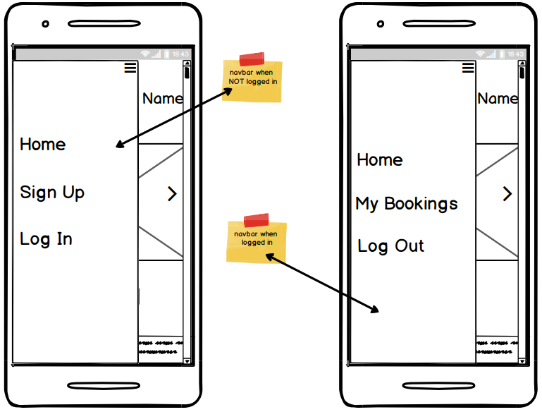
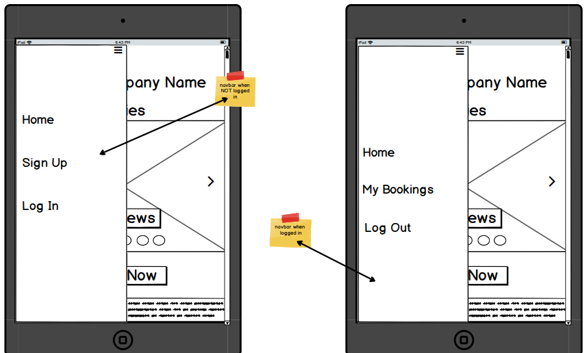
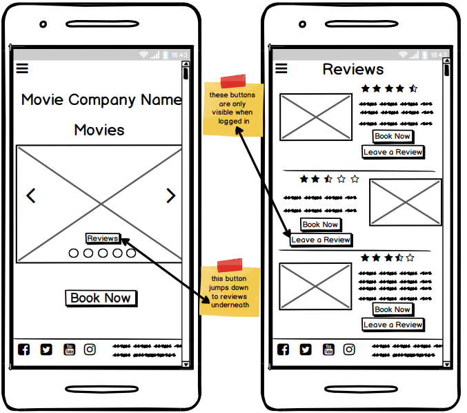
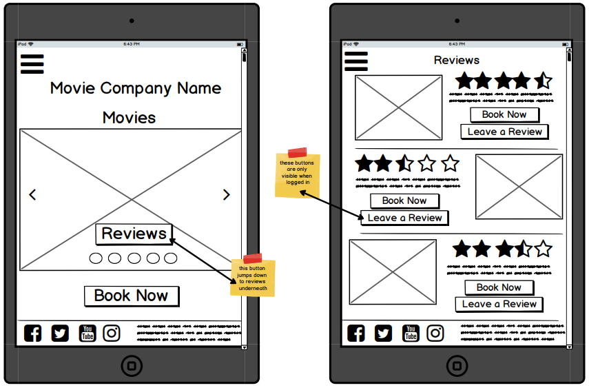
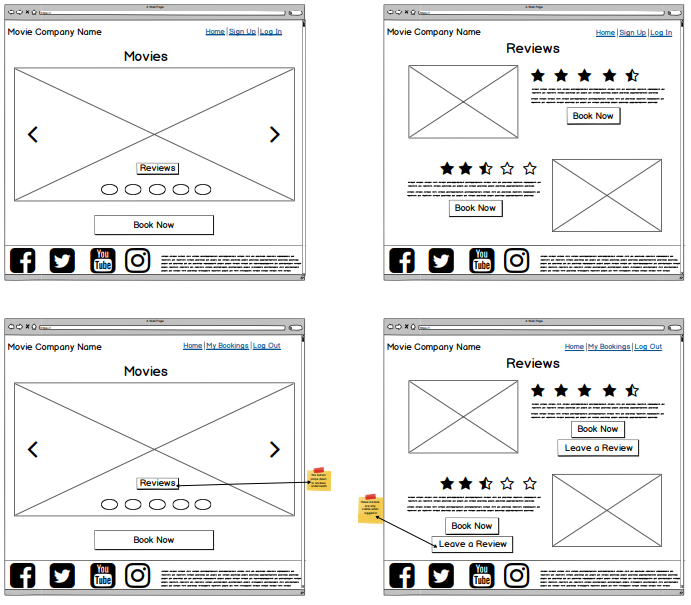
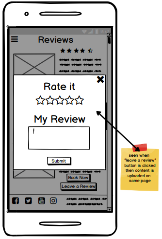
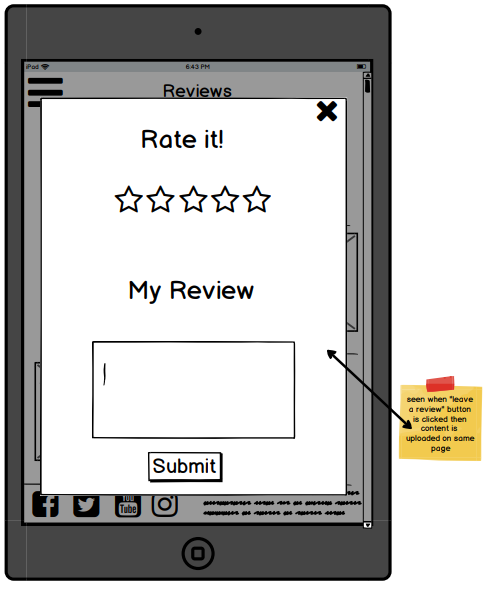
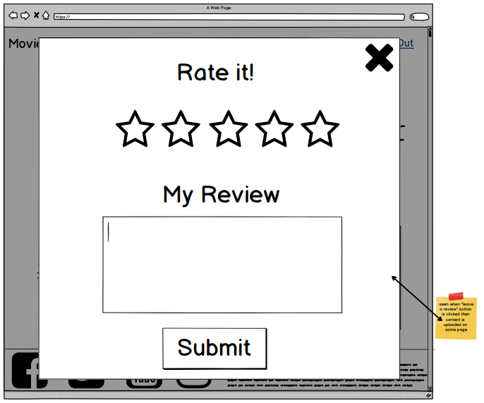
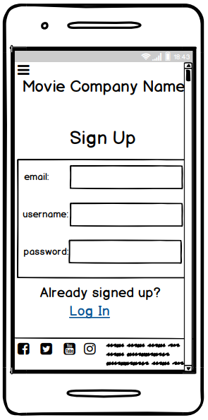
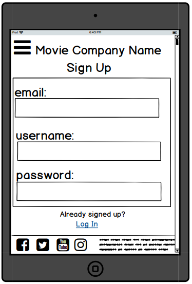
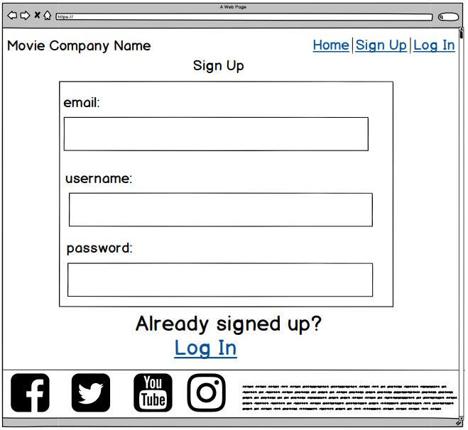
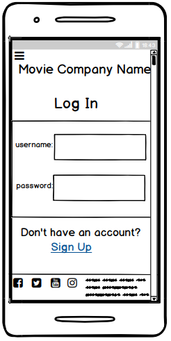
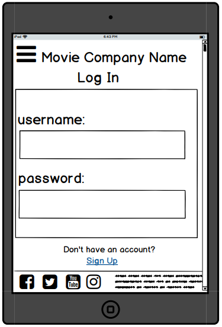

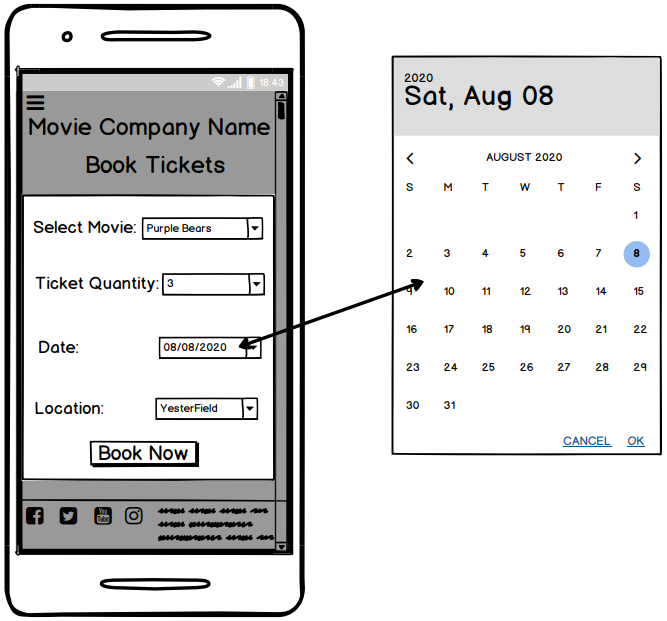
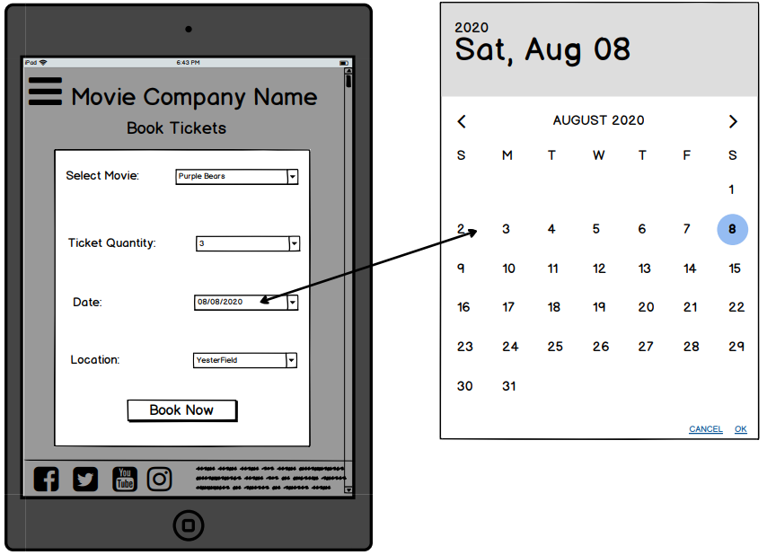
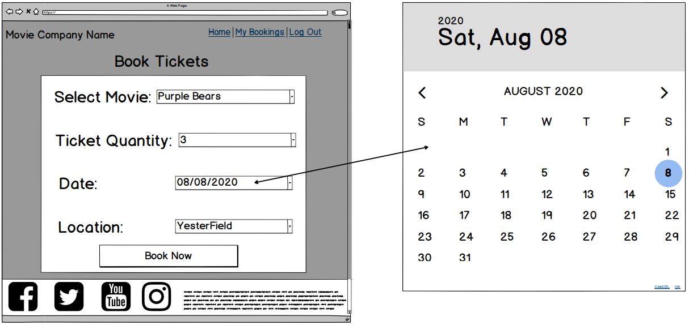
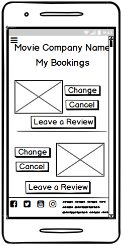
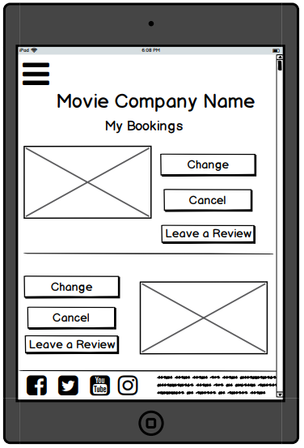
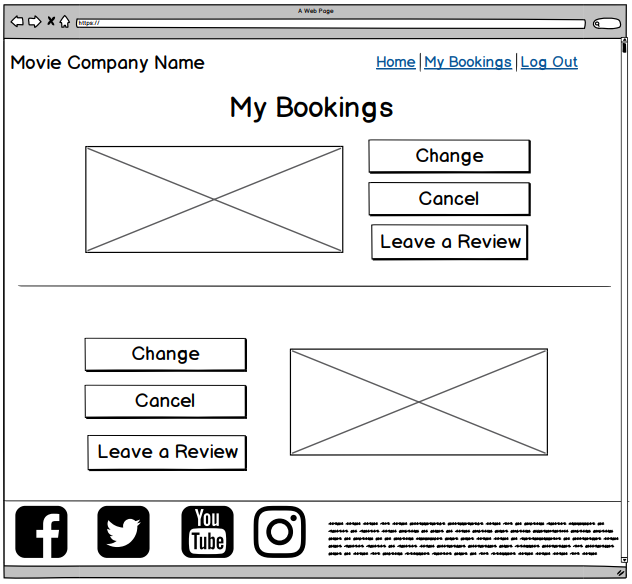
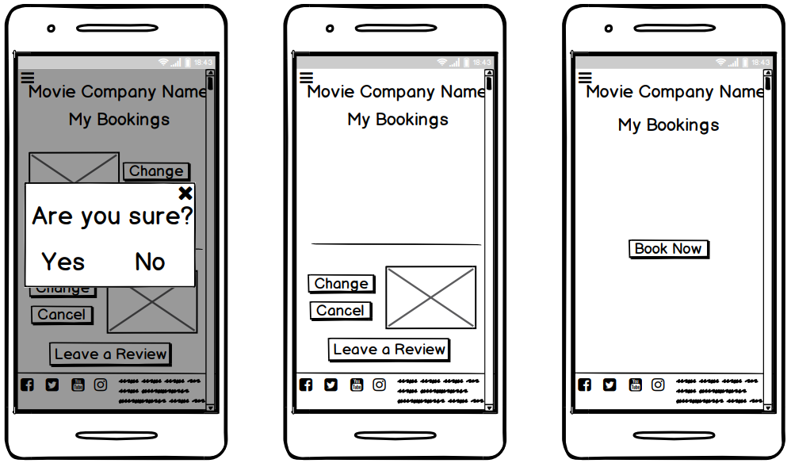

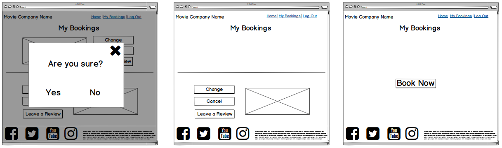
## Wireframe and Final Project Differences
### Home Page      
* The __*Reviews*__ button on the carousel was omitted. Instead each movie poster was made clickable where once clicked, the user would be taken to the corresponding movie review section underneath. As a result, the movie posters were fully visible to the users; not blocked in part by any buttons.
* The __*BOOK NOW*__ button to be placed underneath the carousel was omitted. The button was left to only exist at the end of each review section making it faster and more convenient for the user to book a specific movie.  
* The stars for the star rating system were omitted from being used for the final version of the project. The decision was made to focus on the ability of the user to add descriptive comments about the different movies. It was seen as a more informative method for the user to gain a better understanding on how they might perceive the movie if they were to watch it, by scanning through the opinions left by other users.
* For the first selection box of the booking pop-up modal, the name of the respective movie was made the default choice. The __*Ticket Quantity*__ selection box was changed into an input box so any number chosen by the user could be inputted (except 0). The title of the last selection box was altered to __*Select Location*__. Also, the __*BOOK NOW*__ button was changed to read __*SUBMIT*__ to emphasise that this was what will cause the user’s inputted data to be sent to Cinemagic. These changes were made to make it easier for the users to complete the form with ease.
* The __*LEAVE A REVIEW*__ button was omitted from the homepage to only be present on the user’s bookings page. This was to make leaving a review simpler for the user as they would be able to reference the correct movie they had watched from the same page they were leaving a comment.
### My Bookings Page
* To create a more consistent layout, all the movie’s images were placed on the left-hand side with their details on the right and their reviews at the bottom. Their positions were no longer to be alternated. This was to help user’s learn how to navigate through the website quickly, avoiding frustration.  
* Regarding the user’s booking page, the images were replaced with their movie details i.e.: number of tickets, location of cinema, date for attendance and the owner of the booking. This aimed to provide a more descriptive account of the bookings when referencing, reading or making changes to them. Using an image was not sufficient. In addition, all the buttons were placed underneath the movie details to create a more organised structure.
* The __*Rate it*__ title was replaced with the __*Leave a Review*__ title in the leave a review pop-up modal because the stars were omitted; as previously mentioned.
* The delete pop-up modal’s content was changed to include the name of the selected booked movie to be deleted instead of just the __*Are you sure?*__ confirmation question. It makes it clearer to the user which movie has been selected for deletion. Also, the __*No*__ button was moved to the left-hand side in order to be seen before the __*Yes*__ button. This was done to further help avoid the user from deleting a booking by mistake; giving them more time to confirm.
### Administration Page
* An admin page was added. This was to only be accessible to the administration user. The decision was made to add this page to provide an easier way to interact with the MongoDB database when handling data. 
### Footer
* The __*BOOK NOW*__ button was removed from the user’s bookings page as it could not have the respective movie names as a default selected choice due to there being no other content on the page whenever no bookings were present. This button was to only exist on the homepage as a result.  
* In an attempt to add more design to the footer, the social icons were styled in a grid on top of each other instead of just being inline for all screen sizes.

# Features
## Existing Features
### Top Navigation Bar
- The top navigation bar allows users to access different parts of this project’s app/website by clicking on the links provided at the top of larger screen sized devices. It also displays the name/logo of the movie company for the users to read/see and develop name recognition for Cinemagic.
### Side Navigation Bar
- The side navigation bar allows users to access the company’s navigation links at the side of smaller screen sized devices by clicking/tapping them. This makes the navigation links more responsive on smaller screen sizes as the side navigation bar avoids using a lot of space at the top and is hidden at the side to make room for more of the app/website content to be seen by the user. 
### Home Page
- The home page allows users to view available movies to be booked, from the carousel and from scrolling down the rest of the page. It also allows users to click/tap on the carousel movie images to be automatically jumped down to the corresponding section of the page for more details about the movie. 
- The homepage allows users to view reviews about the movies on offer, created by other users of the website, by scrolling down the page to the corresponding movie sections so the user can be assisted in making a decision on which movies to book.
- The home page allows users to book tickets, a location and a date to watch their selected movie by having them fill out a form that appears in the style of a pop-up modal, before being redirected to their bookings account page. 
- The homepage allows users to scroll down to the bottom of the page to find information about the company telling the users who Cinemagic are by reading their about us section.
### Sign Up Page
- The sign up page allows users to create an account with Cinemagic in order to make bookings of the movies they wish to watch, by having them fill out a form requesting a few of their personal details.
### Login Page
- The login page allows users to log into the app/website to access their bookings page, by filling out the login form with the personal details they used to create an account and having those verified and authenticated to ensure they are correct.
### My Bookings Page
- The my bookings page allows users to read, update and delete their created bookings they made from the homepage by reading through the page and clicking/tapping on the respective buttons to open up the corresponding modals. 
- The my bookings page allows users to leave a review on the movies they booked/watched, to be sent to the respective review sections in the home page for other users of the app/website to view and read, by filling out the form that appears as a pop-up modal once the leave a review button is clicked/tapped.
### Administration Page
- The administration page allows the creator of the app/website to read, update and delete the current movies and locations offered by Cinemagic by having them read the page’s contents, edit the forms on a pop-up modal and confirm the option of deleting them if chosen to do so.
- The administration page allows the creator of the app/website to create and upload new movies and locations for the company by having them fill out forms in the pop-up modals. 
- The administration page allows the creator of the app/website to read the user’s: sign up details, bookings and movie reviews by scrolling down the rest of the page.
### Footer
- The footer allows the users to view links to Cinemagic’s social media outlets and contact details by scrolling to the bottom of the page to read its contents and click/tap on the social links if interested in following their social media handles.

# Technologies Used
## [Python](https://www.python.org/) and [Flask](https://flask.palletsprojects.com/en/1.1.x/quickstart/):
- This project used Python with Flask to produce the backend code that runs on the server, to create the Cinemagic app/website.
## OS:
- This project used OS to provide functions for interacting with the operating system for the Cinemagic app/website.
## Bson.objectid:
- This project used bson.objectid to enable the use of ObjectID when referring to the __*_id*__ data names within the MongoDB database, to produce the data on to the Cinemagic app/website.
## [Werkzeug](https://werkzeug.palletsprojects.com/en/1.0.x/):
- This project used werkzeug.security to provide password authentication when checking for a matched password entered by the user on the Cinemagic app/website.
## [MongoDB](https://www.mongodb.com/): 
- This project used MongoDB to create, store, read, update and delete data regarding the movie details, locations, user details, user reviews and user bookings of the Cinemagic app/website. 
## [Heroku](https://www.heroku.com/): 
- This project used Heroku to deploy and display the final finished version of the Cinemagic app/website.
## PyMongo
- This project used flask_pymongo to utilise the PyMongo library in order to allow for interactions with the MongoDB database through Python, for the Cinemagic app/website.
## Requirements.txt
- This project used a requirements.txt file to allow Heroku to detect the Cinemagic app/website as a Python app.
## Procfile
- This project used a Procfile to inform Heroku on how to run this project’s Cinemagic app/website.
## HTML
- This project used HTML to create the basic structure and layout of the Cinemagic app/website.
## CSS
- This project used CSS to add design to the basic structure and layout of the Cinemagic app/website.
## JavaScript
- This project used JavaScript to add functionality to the features of the Cinemagic app/website.
## [jQuery](https://jquery.com/):
- This project used jQuery to speed up the process of adding the JavaScript functionality to the Cinemagic app/website.
## [Materialize](https://materializecss.com/): 
- This project used Materialize to provide the code of the movie carousel, modals, forms, buttons, tables and navigation bars present in the Cinemagic app/website.
## [Font Awesome](https://fontawesome.com/): 
- This project used Font Awesome to provide the icons used in the Cinemagic app/website. 
## [Google Fonts](https://fonts.google.com/): 
- This project used Google Fonts to provide the font style of the movie posters and the overall appearance of the Cinemagic app/website.
## [Chrome Development Tools](https://developers.google.com/web/tools/chrome-devtools): 
- This project used Chrome Development Tools to see how responsive the Cinemagic app/website looked on different screen sizes and was also used to debug issues regarding editing code taken from external frameworks and libraries.
## [W3C Markup Validation Service](https://validator.w3.org/): 
- This project used W3C Markup Validation Service to check for errors, requiring correction, present in the HTML code of the Cinemagic app/website.
## [CSS Validation Service](https://jigsaw.w3.org/css-validator/): 
- This project used CSS Validation Service to check for errors, requiring correction, present in the CSS code of the Cinemagic app/website.
## [Gitpod](https://www.gitpod.io/): 
- This project used Gitpod as the editor for coding out the README file, HTML, CSS, JavaScript, jQuery and Python portions of the Cinemagic app/website. External libraries and frameworks and images and wireframes were also stored here. In addition, its terminal was used to conduct commands such as: __*git status*__, __*git add .*__, __*git commit -m “...”*__, __*git push -u heroku master*__ etc. to complete this project.
## [GitHub](https://github.com/): 
- This project used GitHub to store the Cinemagic app/website saved code via the __*git push*__ command, as repositories.
## [Balsamiq Wireframes](https://balsamiq.com/): 
- This project used Balsamiq Wireframes to create mockups of what the Cinemagic app/website aimed to look like to the user, on completion.
## Snipping Tool
- This project used the Snipping Tool to edit the movie posters and wireframes for the Cinemagic app/website, as images to be stored on Gitpod.

# Testing
## Base.html
### Links
1. Check to see if the Google Font link is working across this project by going through each page on this app/website and ensuring the predominate font used for the text is  _*Scada*_ or its backup which is  _*sans-serif*_. 
2. Check to see if the Font Awesome link is working across this project by going through each page on this app/website and ensuring all the icons used from Font Awesome, appears accordingly. 
3. Check to see if the Materialize CSS and JS links are working across this project by going through each page on this app/website and ensuring the features taken from Materialize i.e: carousel, forms, modals, cards, navigation bars, tables and buttons are displayed on the pages and can be interacted with by the user.
4. Check to see if the custom CSS link is working across this project by setting the whole page’s background to a very noticeable colour in the _*style.css*_ file, ensuring that the same background colour is displayed on the pages of the app/website. 
5. Check to see if the jQuery CDN link is working across this project by using  _*console.log(“Hello World!”)*_ in a jQuery function, present in the  _*scripts.js*_  file and then accessing the console in the chrome development tools to see if the message can be seen from there.
6. Check to see if the custom JS link is working across this project by using  _*console.log(“Hello World!”)*_ in a custom JavaScript function, present in the  _*scripts.js*_  file and then accessing the console in the chrome development tools to see if the message can be seen from there.
### Page Title
1. Go to the home page.
2. Check the page title in the tab of the opened up brower and ensure its name is the same to the assigned name in the _*base.html*_  file.
### Inherited templates
1. Write the test message: _*Hello World!*_ in the _*index.html*_ file, set to inherit the code from the _*base.html*_ file.
2. Go to the home page. 
3. Check to see if the same  _*Hello World!*_ is present on this page, as if it is then the template has successfully inherited the code.
### Top navigation bar
1. Go to the home page.
2. Using the chrome development tools’ toggle device toolbar to ensure: the navigation bar, its title, bars icon and/or links are all clearly visible and legible on different screen sizes ranging from 320px to 1200px.
3. Drag the chrome development tools’ toggle device toolbar, to ensure the bars icon is displayed from screen sizes 320px to 992px and then removed for screen sizes at 993px or higher.
4. Whilst continuing to drag the chrome development tools’ toggle device toolbar, ensure the navigation links for the other pages of this app/website appear on the right-hand side of the navigation bar for screen sizes greater than 993px.
5. Hover the cursor over the newly appeared links on the navigation bar to ensure a different background colour is shown for the respective link hovered over.  
6. Click on each link present in the navigation bar to ensure they take the user to the correct page based on what the link is called. E.g. click on the _*Sign Up*_ page to ensure the user is redirected to the page where the user can sign up to create an account. For another example, click on the _*My Bookings Page*_ to ensure the user is redirected to the page that will showcase where their booked movies are stored.
7. Ensure the correct link options are shown in the navigation bar, based on the type of user that is interacting with the website. 
    1. If the user is logged in as administration, ensure the links shown are: _*Home*_, _*Admin*_ and  _*Logout*_. 
    2. If the user is logged in but not as administration, ensure the links shown are: _*Home*_, _*My Bookings*_ and  _*Logout*_. 
    3. If the user is not logged in, ensure the links shown are: _*Home*_, _*Sign Up*_ and  _*Log In*_. 
    4. Run its code on both the W3C Markup Validation Service and CSS Validation Service to ensure no errors are found with its HTML and CSS.
### Side navigation bar
1. Go to the home page.
2. Using the chrome development tools, drag the toggle device toolbar to check that the bars icon, for this navigation bar, is clearly visible on different screen sizes ranging from 320px to 992px and then is removed for screen sizes at 993px or higher.
3. Upon clicking the bars icon, ensure the current page of the app/website is covered with a dark, transparent overlay and the side navigation bar appears on the left-hand side of the screen, on top of the overlay.
4. Check the navigation bar to ensure the links and their icons are easy to see and read then hover the cursor over them to ensure a different background colour is shown for the respective link hovered over.  
5. Click on each link present in the navigation bar to ensure they take the user to the correct page based on what the link is called. E.g. click on the _*Sign Up*_ page to ensure the user is redirected to the page where the user can sign up to create an account. For another example, click on the _*My Bookings Page*_ to ensure the user is redirected to the page that will showcase where their booked movies are stored.
6. Ensure the correct link options are shown in the navigation bar, based on the type of user that is interacting with the website. 
    1. If the user is logged in as administration, ensure the links shown are: _*Home*_, _*Admin*_ and  _*Logout*_. 
    2. If the user is logged in but not as administration, ensure the links shown are: _*Home*_, _*My Bookings*_ and  _*Logout*_. 
    3. If the user is not logged in, ensure the links shown are: _*Home*_, _*Sign Up*_ and  _*Log In*_. 
    4. Run its code on both the W3C Markup Validation Service and CSS Validation Service to ensure no errors are found with its HTML and CSS.
### Footer
1. Go to the home page.
2. Using the chrome development tools, drag the toggle device toolbar to check both the social media icons and the contact details stay within the footer area without going over it and are legible on all different screen sizes, from 320px to 1200px, to ensure their responsiveness. 
3. Whilst dragging the toggle device toolbar, also check that the footer remains at the bottom of the screen for every screen size and covers the full width of the screen without going over.
4. Click on each social media icon and check that a separate tab opens, away from the project, to the homepage of the respective social media website.

# Deployment
This project was deployed to Heroku using the following steps:
1. Set __*debug=False*__ in the app.py file.
2. Created a requirements.txt file from the terminal, using __*pip3 freeze --local > requirements.txt*__, to allow Heroku to detect this project as a python app. 
3. Created a Procfile using __*echo web: python app.py > Procfile*__ from the Gitpod terminal so Heroku would be informed on which file runs the app and how to run this project. 
4. Created a web process using __*heroku ps:scale web=1*__ in the Gitpod terminal of the project.
5. Set the __*IP*__ address and __*PORT*__ environmental variables to __*0.0.0.0*__ and __*5000*__ respectively, to create the config variables on Heroku.
6. Added the __*SECRET KEY*__, __*MONGO URI*__ string and the __*MONGO_DBNAME*__ to Heroku as part of the config variables.
7. Created a new Heroku app, uniquely named it after this project i.e. __*milestone-project-3-vivian*__ and set its region to Europe.
8. Installed the Heroku command line interface/toolbelt and typed __*heroku*__ in the Gitpod terminal to ensure Heroku had been installed in Gitpod.
9. Typed __*heroku login*__ in the Gitpod terminal and copied the URL browser link provided into a new browser to login into Heroku.
10. Linked local GitHub repository to Heroku which allowed for git commits, from the Gitpod terminal, to be pushed from Gitpod to Heroku.
11. Added the Heroku git URL as a remote in the Gitpod terminal using __*git remote add heroku https://git .heroku.com/milestone-project-3-vivian.git*__
12. Used __*git add .*__ to add everything from the project then __*git commit -m “Deploy project” and git push -u heroku master*__ to commit and push the project to Heroku respectively.
13. Clicked the __*Enable Automatic Deploys*__ button located in the __*Deploy*__ section of Heroku to allow for automatic deploys.
14. Clicked the __*Deploy Branch*__ button located in the __*Deploy*__ section of Heroku to finally deploy this project.
15. Clicked the __*View*__ button to launch this project's app.

# Credits
## Content
- Some of the responsive breakpoints used were taken from Bootstrap.
- The fonts used in this project were taken from Font Awesome.
- Code from Materialize was used to create the following:
  - The movie carousel
  - All the modals
  - All forms in the modals 
  - All cards of the forms, navigation bars and footer
  - All tables present on the administration page
  - All the buttons
  - Both the top and side navigation bars
## Media
- The following images used for this app/website were taken from Unsplash:
  - Photo by Ian Espinosa: https://unsplash.com/photos/rX12B5uX7QM
  - Photo by Ryan Walton: https://unsplash.com/photos/AbNO2iejoXA
  - Photo by Greg Rakozy: https://unsplash.com/photos/oMpAz-DN-9I
  - Photo by Daniel Jensen: https://unsplash.com/photos/NMk1Vggt2hg 
  - Photo by Mathilda Khoo: https://unsplash.com/photos/xgsbOPIx75I
  - Photo by Valentin Antonucci: https://unsplash.com/photos/9cRDDvhpBRw
  - Photo by Dollar Gill: https://unsplash.com/photos/hYr1wGeDSU0
  - Photo by Max Kleinen: https://unsplash.com/photos/Jigc7F9q7Ik
  - Photo by Alessio Lin: https://unsplash.com/photos/mSoetyVbW_Y
  - Photo by Lucas Gouvêa: https://unsplash.com/photos/aoEwuEH7YAs
## Acknowledgements
- I received inspiration for this project from the following websites:
  - MOVIETICKETS.COM: https://www.movietickets.com/
  - IMDb: https://www.imdb.com/
  - ODEON: https://www.odeon.co.uk/ 
  - SHOWCASE: https://www.showcasecinemas.co.uk/
  - VUE: https://www.myvue.com/
  - Stackoverflow: https://stackoverflow.com/questions/38196104/how-to-change-background-color-of-datepicker-form-in-materialize-design
  - W3schools.com : https://www.w3schools.com/howto/howto_css_image_text.asp
  - RandomKeygen: https://randomkeygen.com/
  - Masterpiece Generator: https://www.name-generator.org.uk/quick/ 
  - Fantasy Name Generators: https://www.fantasynamegenerators.com/film-studio-names.php 
